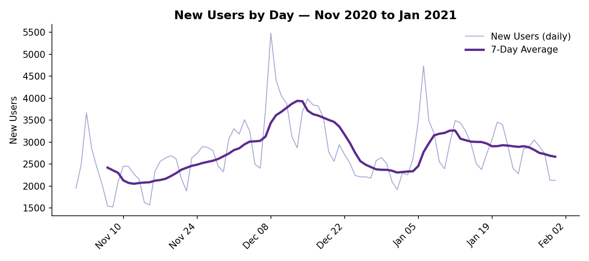
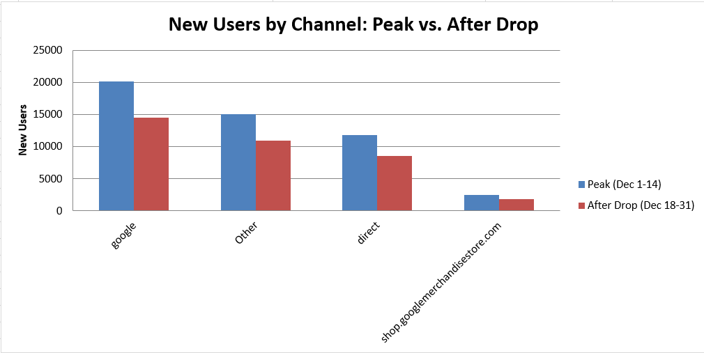
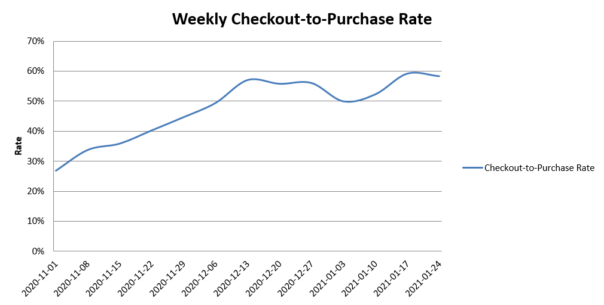
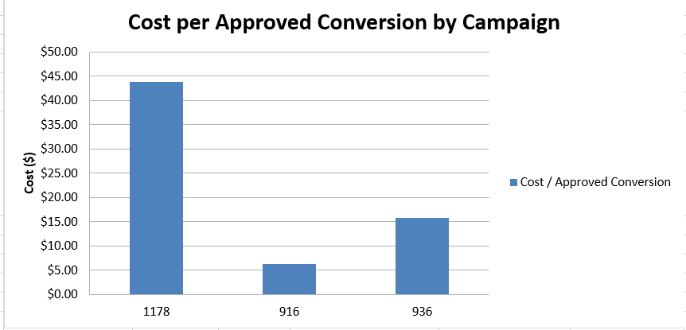

# Marketing Funnel Drop-off & New User Acquisition Investigation

A data analyst case study: diagnosing a real ~28% drop in new-user acquisition using SQL (BigQuery) and Excel, plus a separate paid-acquisition analysis on real Facebook Ads data.

**Tools used:** SQL (BigQuery), Excel
**Datasets:** [GA4 Merchandise Store sample](https://developers.google.com/analytics/bigquery/web-ecommerce-demo-dataset) (Google's public BigQuery dataset, real e-commerce event data) and the [Facebook Ad Campaign dataset](https://www.kaggle.com/datasets/madislemsalu/facebook-ad-campaign) (Kaggle, real ad account data)

---

## Business problem

> "New user signups have dropped. As the data analyst supporting the marketing team, investigate the root cause and recommend next steps."

This mirrors a real case question I was asked in a data analyst interview. This project is my own follow-up: working the question end-to-end on real data, the way I'd actually approach it on the job — SQL for the analysis, Excel for the rates, charts, and summary, since that's the day-to-day toolset for the role.

## Approach

1. **Confirm the terms.** The dataset has no native "signup" event, so I checked what events actually exist before assuming anything ([Query 1](sql/analysis_queries.sql)) — `first_visit` is used as a documented proxy for a new user.
2. **Find the real trend.** A 7-day average of new users by day shows a real, sustained decline — not daily noise.
3. **Split traffic from conversion.** The single most important question: did fewer people show up, or did the same number show up and convert worse? These need completely different fixes.
4. **Check concentration.** Is the drop in one channel, or everywhere?
5. **Check the funnel and downstream conversion.** Did anything break further down, past the point where a user first shows up?

## Key findings

| Metric | Peak (Dec 1–14) | After drop (Dec 18–31) | Change |
|---|---|---|---|
| Visitors | 54,308 | 38,747 | **−28.7%** |
| New users | 49,392 | 35,731 | **−27.7%** |
| New-user rate | 90.9% | 92.2% | **+1.27pp (improved)** |



**The decline is a traffic problem, not a conversion problem.** Visitors fell almost exactly as much as new users did, and the conversion rate itself slightly *improved* during the decline. Nothing downstream broke — the checkout-to-purchase rate held at its highest levels of the whole period even as volume fell.



Every major channel dropped by roughly the same 27–29% — this rules out a single broken campaign or channel-specific tracking issue. The pattern is consistent with a post-holiday cooldown after a Black Friday/Cyber Monday/Christmas peak.



**One data-quality catch along the way:** an early check on `add_to_cart` suggested it was barely tracked (4 events in a week where checkout had 800+ users) — but rerunning the same check on December data showed cart events were actually normal. The gap was specific to the first week I checked, not the dataset. Caught it, corrected it, and said so — the full writeup in the [case study doc](docs/Marketing_Funnel_Dropoff_Case_Study.docx) keeps both the mistake and the correction visible rather than only showing the clean final version.

## Paid acquisition analysis (separate)

Using the real Facebook Ad Campaign dataset to evaluate paid acquisition efficiency — kept **fully separate** from the investigation above, since there's no real key linking Facebook's campaign IDs to GA4's traffic data. This doesn't explain the December decline; it's a second, independent demonstration of evaluating ad spend.



- **Campaign 1178** — the biggest spend ($16,577) but the least efficient ($43.86 per approved conversion)
- **Campaign 916** — the most efficient ($6.24), though on a small sample (24 approved conversions)
- **Audience:** women aged 30–34 were the standout segment at $7.02 per approved conversion, ~3.7x more efficient than men the same age

**Data quality note:** 382 of 1,143 rows (33%) in the raw Facebook CSV were missing `campaign_id` and `fb_campaign_id` entirely — checked against the raw file, not just the parsed output — and excluded explicitly rather than silently dropped by a `GROUP BY`.

## Recommendation

- Don't reallocate budget away from any channel — the decline is proportional, not channel-specific
- Don't prioritize funnel/checkout optimization for this drop — conversion held steady or improved
- Validate against the same calendar window in a prior year to confirm this is normal seasonality
- Consider a retention push aimed at the ~49K users acquired during the December peak, rather than trying to re-inflate a naturally quieter period

## Repo contents

```
sql/analysis_queries.sql      -- all 8 queries, commented, ready to run in BigQuery
excel/                        -- workbook: Executive Summary + 7 analysis tabs, live formulas & charts
docs/                         -- full write-up: methodology, hypotheses, findings, data-quality notes
images/                       -- chart exports used in this README
```

## Notes on the data

Both datasets are real, not synthetic — a public BigQuery sample from Google's own online store, and a real (anonymized) Facebook ad account export. They're unrelated businesses, which is exactly why the two analyses are kept separate rather than joined. The full methodology — including where I got something wrong the first time and fixed it — is in the [case study doc](docs/Marketing_Funnel_Dropoff_Case_Study.docx).
